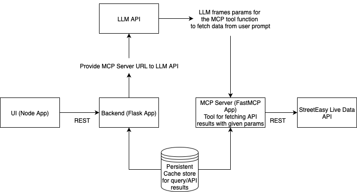

# 🏙️ AIStreetEasy

Discover your perfect home in NYC with the power of AI. We harness StreetEasy's live data combined with natural language processing to deliver a seamless, intuitive search experience. Simply describe what you're looking for in plain English, and let our intelligent platform find properties that match your exact needs and preferences.


---

## ✨ Summary

AIStreetEasy is a multi-component system built specifically for New York City real estate. It features a web interface, a Model Context Protocol (MCP) server that interacts with StreetEasy's live data, and a backend server that queries Claude API with the MCP server as the data source. Together, these components enable users to search for NYC properties using natural language, delivering accurate and personalized results in real time.

---

## 🛠️ Backend Logic

- **Web Server**: Handles user interactions and displays data.
- **MCP Server (Model Context Protocol)**: Serves as the datasource for the LLM, LLM transforms any query into the the input params for the MCP tool, the MCP tool inturns queries StreetEasyAPI to get true live data of rentals, which the LLM formats to the desired format for the backend to process.
- **Backend Server**: Processes data, queries Claude with the MCP server, and manages the database.

---

## 🗺️ Architecture Flowchart



---

## 🎥 Demo Video

<!-- Add your demo video here -->

---


## 🚀 To Dos

- **Backend Caching**: Implement an external caching application on the backend server to enable persistent storage of frequently accessed data, improving performance and reducing redundant processing.
- **MCP Server Query Storage**: Enhance the MCP server to store query results locally, minimizing repeated API calls to StreetEasy endpoints and optimizing response times for recurring queries.


# 📦 Web Server

This is the web server component of the AIStreetEasy project. It provides a user-friendly web interface for searching NYC real estate listings using natural language queries, powered by AI and live StreetEasy data.

## Getting Started

### Prerequisites

- [Node.js](https://nodejs.org/) (v16 or newer recommended)
- [npm](https://www.npmjs.com/) (comes with Node.js)

### Installation

1. Open a terminal and navigate to this directory:

   ```sh
   cd /Users/maha/Documents/Projects/AIStreetEasy/web_server
   ```

2. Install dependencies:
   ```sh
   npm install
   ```

3. Running the Server
   ```sh
   npm start
   ```

By default, the server runs on http://localhost:3000.


---

# 🔗 MCP Server

This is the MCP (Multi-Component Pipeline) server for the AIStreetEasy project. It provides tools for querying NYC rental listings from the RedAPI StreetEasy API (https://rapidapi.com/realestator/api/streeteasy-api/playground/apiendpoint_9e37dc9d-f9dd-4601-8447-21cc9717db0c) and serves as a data source for the AI backend. If the API fails for some reason, there is a mock data that we return that mocks the API call.

## MCP Tool: fetch_all_listings_by_params

This tool fetches rental listings from the RedAPI StreetEasy API that match the provided parameters.

### Arguments

- **areas**: The NYC areas and neighborhoods to filter for.
- **minPrice**: The minimum price of a property.
- **maxPrice**: The maximum price of a property.
- **minBeds**: The minimum number of bedrooms.
- **maxBeds**: The maximum number of bedrooms.
- **minBaths**: The minimum number of bathrooms.
- **noFee**: Whether to filter for no-fee listings (`True` or `False`).

#### Example query string

```json
{
    "areas": "all-downtown,all-midtown",
    "minPrice": "2000",
    "maxPrice": "4000",
    "minBeds": "1",
    "maxBeds": "10",
    "minBaths": "1",
    "noFee": "false",
    "limit": "100",
    "offset": "0"
}
```

## Running the Server

1. Export your StreetEasy API key (required):

   ```sh
   export STREETEASY_API_KEY='your-rapidapi-key-here'
   ```

2. Start the MCP server (runs on port 9000):

   ```sh
   uv run main.py
   ```

3. Expose the MCP server to the public (required for Claude/AI backend to access). The MCP server must be accessible via a public HTTPS URL. For development, you can use ngrok (Warning: Exposing your local server to the public internet can be risky. For production, host the MCP server securely on a cloud provider.):  

   ```sh
   ngrok http 9000
   ```

4. Set the MCP server public HTTPS URL (for the backend to connect):   

   ```sh
   export MCP_URL='<mcp-server-url>/mcp/'
   ```


You can install dependencies with:

   ```sh
   pip install .
   ```

---

# 🧠 Backend Server

This is the backend server for the AIStreetEasy project. It acts as an API layer between the web UI and the AI/mcp server, handling user queries and returning NYC rental data.

## How it works

- The UI makes two HTTP requests to this backend:
  1. **POST** `/submit_query`: Accepts a user query and returns a `query_id`.
  2. **GET** `/get_query_response/<query_id>`: The UI polls this endpoint to retrieve the results for the given `query_id`.

- The backend calls the Claude API, using the MCP server as a data source, to fetch and process NYC rental data.

## Running the Server

1. **Set your Anthropic API key** (required for Claude API access):

   ```sh
   export ANTHROPIC_API_KEY='your-api-key-here'
   ```

2. Set the MCP server public https url (refer to the MCP server section on how to expose local host to public):

   ```sh
   export MCP_URL='mcp-server-url'
   ```

3. Start the server using uvicorn:   
   ```sh
   uv run main,py
   ```

The server will be available at http://localhost:9001 by default.

You can install dependencies with:

   ```sh
   pip install .
   ```